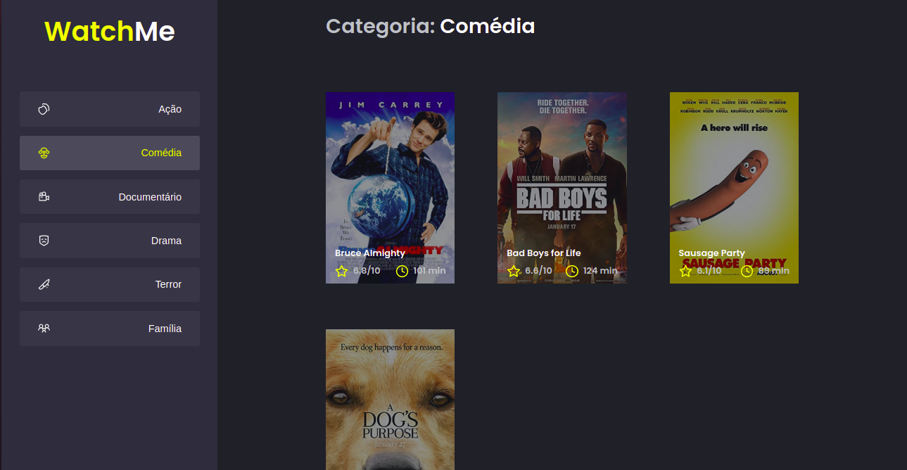

  

  <b>WatchMe Listagem de filmes.</b>

 

  
    

## Conteúdo

- [Sobre](#sobre)
- [Tecnologias](#tecnologias)
- [Pré-requisitos](#pre-requisitos)
- [Como usar](#como-usar)
- [Como contibuir](#como-contribuir)

## :bookmark: Sobre

<strong>WatchMe</strong> é uma aplicação que tem o objetivo de realizar uma listagem de filmes de acordo com seu gênero.

Essa aplicação foi construída na trilha <strong>Ignite</strong> distribuída pela [Rocketseat](https://rocketseat.com.br/).

## :rocket: Tecnologias Utilizadas

O projeto foi desenvolvido utilizando as seguintes tecnologias

- [TypeScript](https://www.typescriptlang.org/)
- [ReactJS](https://reactjs.org/)

## :fire: **Pré-requisitos**

- [NPM](https://www.npmjs.com/) ou [Yarn](https://yarnpkg.com/)

## :zap: Como usar

- Faça um clone desse repositório: 
`git clone https://github.com/Giovanni-786/WatchMe.git`

- Instale as dependências: `yarn`
- Inicie a aplicação:
    - Rode o comando de inicialização: `yarn dev`
    - Inicalize a API: `yarn server`

## :recycle: Como contribuir

- Faça um Fork desse repositório,
- Crie uma branch com a sua feature: `git checkout -b my-feature`
- Commit suas mudanças: `git commit -m 'feat: My new feature'`
- Push a sua branch: `git push origin my-feature`

## :mortar_board: Quem ministrou?

As aulas foram ministradas pelo mestre **[Diego Fernandes](https://github.com/diego3g)** nas aulas da **Ignite**.

---

<h4 align=center>Made with 💙 by <a href="https://www.linkedin.com/in/giovanni-sena/">Giovanni Lima</a></h4>
